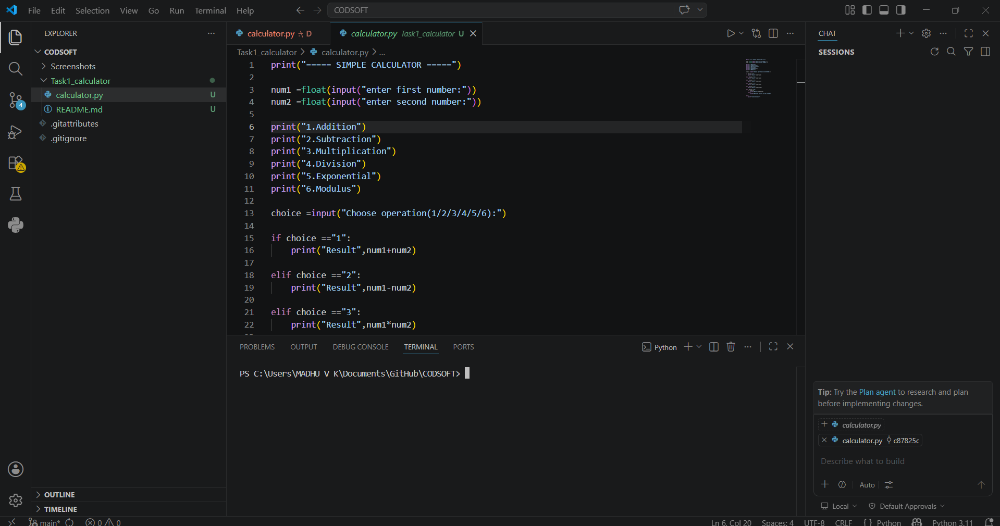
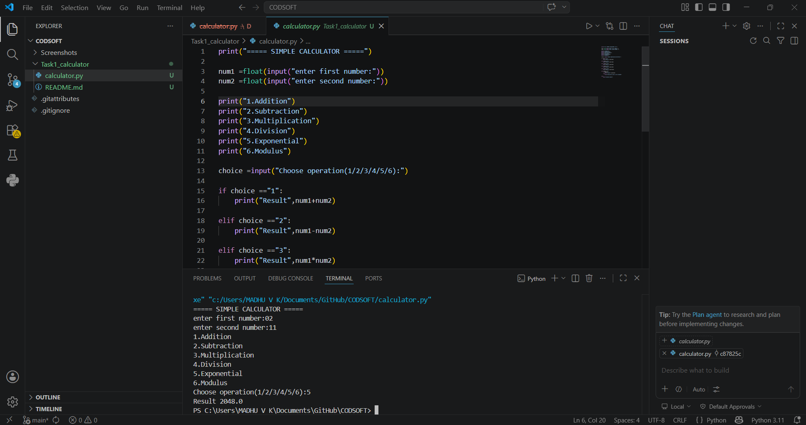

## Simple Calculator using Python

A command-line based calculator application developed using Python.  
This project performs basic arithmetic operations with a clean and user-friendly interface.

---

##  Features

- Addition
- Subtraction
- Multiplication
- Division
- Exponentiation
- Modulus Operation
- Simple CLI Interface
- Fast and Lightweight

---

##  Technologies Used

- Python
- VS Code
- GitHub

---

##  Project Structure

Task1_calculator/

 calculator.py
 README.md
 output_video.mp4
 Screenshots/
 code_ss.png
 output_ss.png

---

## ▶️ How to Run

---------------

### 1.clone the Respository

```bash

git clone https://github.com/madhu6-max/CODSOFT.git
```

### 2.Open project folder

1. Navigate to project folder

```bash

cd CODSOFT/Task1_calculator
```

### 3.Run the project Program

1. Execute the calculator application using:

```bash

python calculator.py
```

### 4.Choose operation

Select any operation from:
- Addition
- Subtraction
- Multiplication
- Division
- Exponentiation
- Modulus

Then enter the required numbers to get the result instantly.

# Example

```bash
Enter first number: 10
Enter second number: 5
```
1. Addition
2. Subtraction
3. Multiplication
4. Division
5. Exponentiation
6. Modulus

Choose operation: 3

Result = 50

This version looks much more professional because it includes:
- cloning instructions,
- folder navigation,
- execution steps,
- usage explanation,
- example output.


---

##  Screenshots

###  Code Preview



---

###  Output Preview



---

##  Demo Video

A demo video showcasing the working of the calculator application is included in the project folder.

File Name:

https://github.com/user-attachments/assets/02ef2e1b-f832-4c72-ad0e-99f6ea01a70e


---

##  Author

**Andra Madhu Veera Kumar**

- GitHub: https://github.com/madhu6-max
- Domain: Python Programming & Cyber Security
- Internship Project under CodSoft
