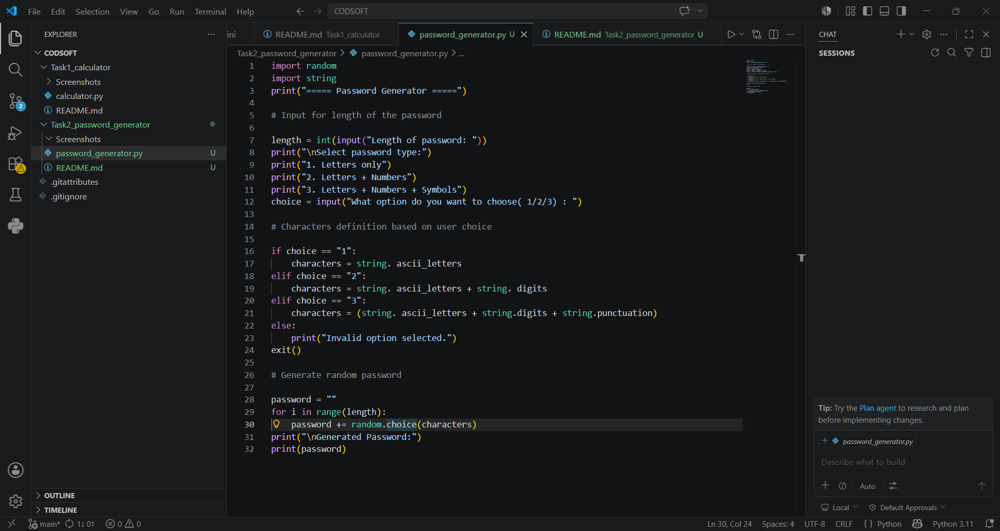
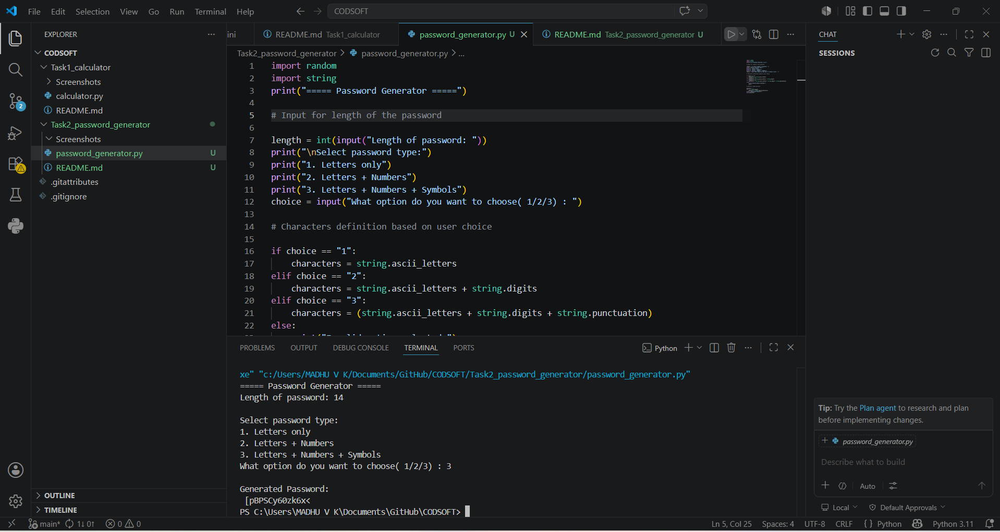

# Password Generator using Python

- A command-line based password generator developed using Python.  
- This project generates strong and random passwords based on user-selected complexity and desired length.

---

## Features

- Generate random passwords
- Letters only option
- Letters + Numbers option
- Letters + Numbers + Symbols option
- User-defined password length
- Simple CLI Interface
- Fast and Lightweight

---

##  Technologies Used

- Python
- VS Code
- GitHub

---

##  Project Structure

Task2_password_generator/

- password_generator.py
- README.md
- Screenshots/
- code_ss.png
- output_ss.png
- output_video.mp4

---

## ▶️ How to Run

-----------------

### 1.clone the Repository

```bash

- git clone https://github.com/madhu6-max/CODSOFT.git
```

### 2.Open project folder

1. Navigate to project folder

```bash

- cd CODSOFT/Task2_password_generator
```

### 3.Run the project Program

1. Executee the password_generator program using;

```bash

- python password_generator.py
```

## Example

Length of password: 8
Select password type:

1. Letters only
2. Letters + Numbers
3. Letters + Numbers + Symbols

- Choose option:

What option do you want to choose (1/2/3): 3

Generated password will display:

- Result =

Generated Password:
@K9#pL2$

- The password is generated randomly every execution.


--- 

## Screenshots

### Code Preview



---

### Output Preview



---

## Demo Video

- A demo video showcasing the working of the password generator application is included below.

File Name:

[Watch Password Generator Demo](Screenshots/output_video.mp4)

---


## Author

**Andra Madhu Veera Kumar**
- GitHub: https://github.com/madhu6-max⁠
- Domain: Python Programming & Cyber Security
- Internship Project under CodSoft