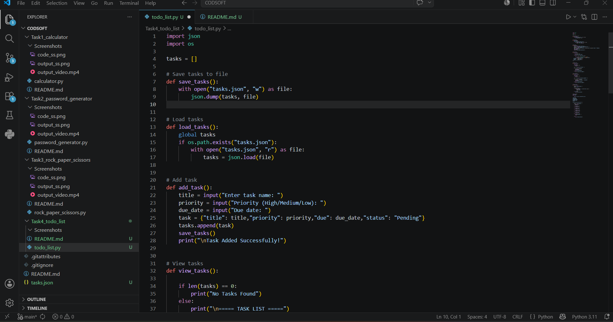
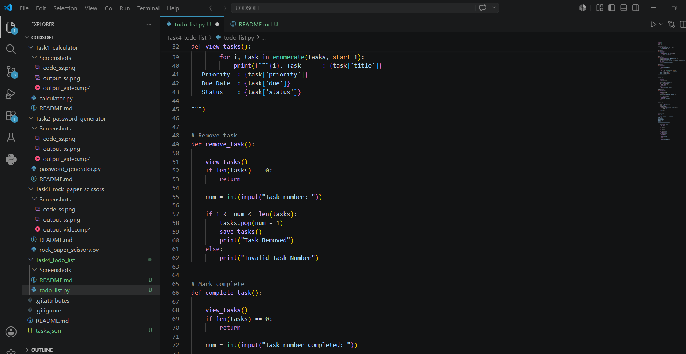
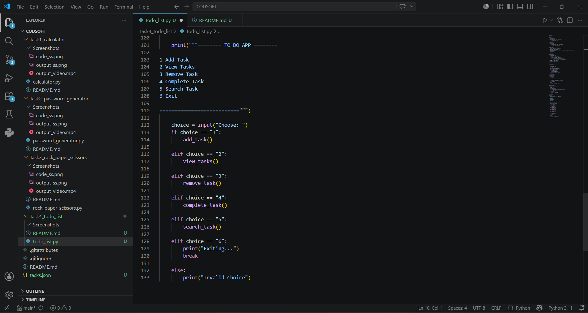
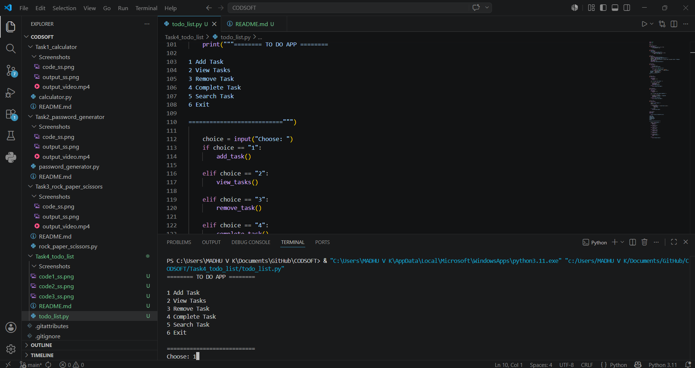

# To-Do List Application using Python

- A simple command-line based To-Do List application developed using Python.

- This application helps users manage daily tasks by adding, viewing, and removing tasks efficiently.

---

##  Features

- Add new tasks
- View all tasks
- Remove completed tasks
- User-friendly CLI interface
- Lightweight and fast
- Task management system

---

##  Technologies Used

- Python
- VS Code
- GitHub

---

##  Project Structure

Task4_todo_list/

- Screenshots/
-  code1_ss.png
-  code2_ss.png
-  code3_ss.png
- output_ss.png
- output_video.mp4
- README.md
- tasks.json
- todo_list.py

---

## ▶️ How to Run

------------------

### 1. Clone the Repository

```bash

- git clone https://github.com/madhu6-max/CODSOFT.git
```

### 2.Open the project folder


1. Navigate to project folder

```bash

- cd CODSOFT/Task4_todo_list
```

### 3. Run the program


1. Execute the todo_list using;

```bash

- python to_do_list.py
```

---

##  Example Output

```txt

===== TO-DO LIST APPLICATION =====


1. Add Task
2. View Tasks
3. Remove Task
4. Exit

- Enter choice: 1
- Enter new task: Complete project

Task added successfully!

```


##  Screenshots


### Code Preview








---


### Output Preview





---

##  Demo Video

[Watch Demo Video](Screenshots/output_video.mp4)

---

##  Author

**Andra Madhu Veera Kumar**

- GitHub: https://github.com/madhu6-max
- Domain: Python Programming & Cyber Security
- Internship Project under CodSoft