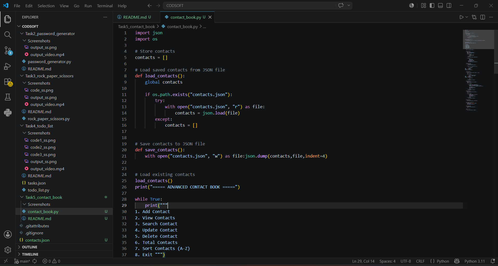
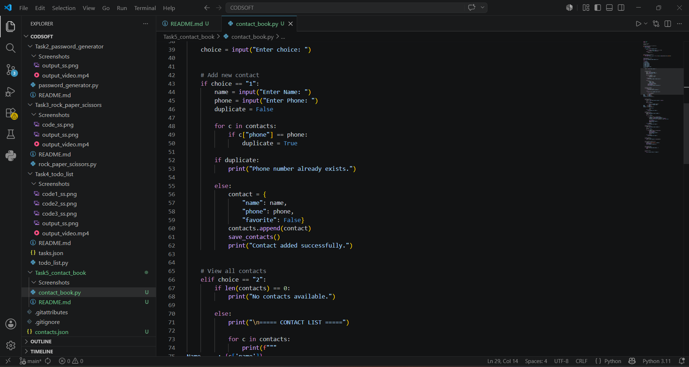
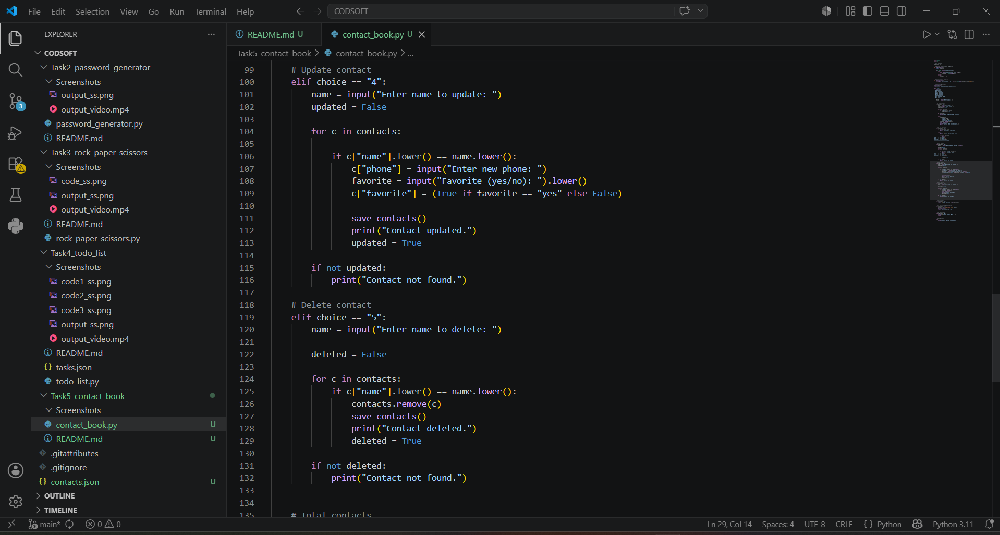

#  Advanced Contact Book using Python

- An advanced command-line Contact Book application developed using Python.

- This project allows users to add, search, update, delete, sort, and manage contacts efficiently with permanent JSON storage support.

---

##  Features

- Add new contacts
- View all saved contacts
- Search contacts by name
- Update contact details
- Delete contacts
- Sort contacts alphabetically (A-Z)
- Display total contacts count
- Prevent duplicate phone numbers
- Favorite contact support
- Automatic JSON storage
- Persistent data after program restart

---

##  Technologies Used

- Python
- JSON
- VS Code
- GitHub

---

##  Project Structure


Task5_contact_book/

Screenshots/
-  code1_ss.png
-  code2_ss.png
-  code3_ss.png
- output_ss.png
- output_video.mp4
- contact_book.py
- contact.json
- README.md

---

## ▶️ How to Run

---------------

### 1. Clone the Repository

```bash

- git clone https://github.com/madhu6-max/CODSOFT.git
```

### 2.Open the project folder

1. Navigate to project folder

```bash

- cd CODSOFT/Task5_contact_book
```

### 3. Run the Program

1. Execute the contact_book using;

```bash

- python contact_book.py
```

---

### Example 


##  Menu Options

1. Add Contact
2. View Contacts
3. Search Contact
4. Update Contact
5. Delete Contact
6. Total Contacts
7. Sort Contacts (A-Z)
8. Exit


---

##  Example Output

```txt

===== ADVANCED CONTACT BOOK =====

1. Add Contact
2. View Contacts
3. Search Contact
4. Update Contact
5. Delete Contact
6. Total Contacts
7. Sort Contacts (A-Z)
8. Exit
```

- Enter choice: 1

- Enter Name: Madhu
- Enter Phone: 9876543210

- Contact added successfully.


---

##  Screenshots

###  Code Preview







---

###  Output Preview

https://github.com/user-attachments/assets/fa41e81f-6e6c-49f0-bb7a-89ea71a679ec

---

##  Demo Video

- A demo video showcasing the working of the Contact Book application is included in the project folder.

[Watch Demo video](Screenshots/output_video.mp4)

---

### Author

**Andra Madhu Veera Kumar**

- GitHub: https://github.com/madhu6-max
- Domain: Python Programming & Cyber Security
- Internship Project under CodSoft
